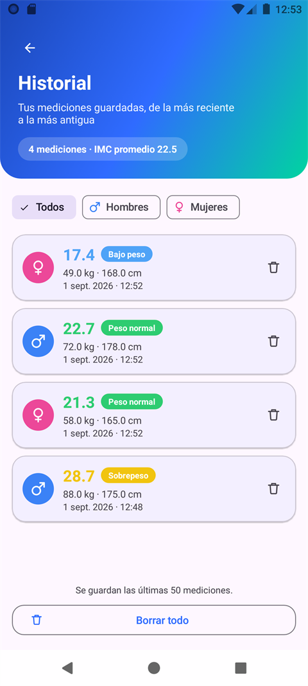

# IMCApp

Aplicación Android para calcular el **Índice de Masa Corporal (IMC)**: una animación de
bienvenida, la calculadora (que distingue entre hombre y mujer), el historial de mediciones
y los datos del desarrollador.

Escrita en **Kotlin** con vistas XML y **Material Design 3**.

> Este proyecto es una de las ramas del repositorio
> [DesarrolloMovil](https://github.com/Syxsexe/DesarrolloMovil).

---

## Capturas

| 1. Animación | 2. Calculadora | 3. Historial | 4. Desarrollador |
| :---: | :---: | :---: | :---: |
|  |  |  |  |

---

## Las pantallas

### 1. Animación de bienvenida — `SplashActivity`

Es la pantalla de lanzamiento. Dura 2.6 segundos y luego abre la calculadora con un fundido.

- Fondo con degradado diagonal azul → verde agua.
- El logo entra con rebote (`OvershootInterpolator`) dentro de un anillo punteado que gira en bucle.
- Latido suave del icono, títulos que suben con desvanecido escalonado y barra de progreso
  que marca el tiempo restante.

### 2. Calculadora de IMC — `MainActivity`

- Selector de **sexo** (hombre / mujer) obligatorio, que queda recordado para la próxima vez.
- Campos de **peso (kg)** y **altura (cm)** con validación: campo vacío, texto no numérico
  y rangos fuera de lo razonable. Acepta coma o punto como separador decimal.
- El resultado aparece deslizándose y el número **cuenta desde 0** hasta el IMC final.
- Categoría según la OMS con color propio, mensaje orientativo y **rango de peso ideal**
  calculado para esa altura.
- Escala de colores de 15 a 40 con un marcador triangular que se desliza hasta tu posición.
- Botón **Limpiar** que reinicia el formulario y oculta el resultado con animación.
- Cada cálculo válido se guarda en el historial y un *snackbar* ofrece abrirlo.

| IMC | Categoría |
| --- | --- |
| menor a 18.5 | Bajo peso |
| 18.5 – 24.9 | Peso normal |
| 25.0 – 29.9 | Sobrepeso |
| 30.0 – 34.9 | Obesidad grado I |
| 35.0 – 39.9 | Obesidad grado II |
| 40.0 o más | Obesidad grado III |

#### Qué cambia entre hombre y mujer

El IMC y las categorías de la OMS **son iguales para ambos sexos**: la fórmula sólo usa peso y
altura. Lo que sí depende del sexo es lo que la app añade al resultado:

| | Hombre | Mujer |
| --- | --- | --- |
| Peso ideal (fórmula de Lorentz) | altura − 100 − (altura − 150) / **4** | altura − 100 − (altura − 150) / **2.5** |
| Grasa corporal saludable de referencia | 8 % – 19 % | 21 % – 33 % |

Para 175 cm eso da **68.75 kg** en hombres y **65.0 kg** en mujeres. El sexo también colorea la
insignia del resultado y cada fila del historial, y sirve para filtrar la lista.

### 3. Historial — `HistoryActivity`

- Lista de las mediciones guardadas, de la más reciente a la más antigua, con IMC, categoría,
  peso, altura y fecha.
- **Filtro por sexo**: *Todos*, *Hombres* o *Mujeres*, con el promedio de IMC de lo que se ve.
- Borrado de una medición con opción de **deshacer**, o vaciado completo con confirmación.
- Se conservan las últimas 50 mediciones en `SharedPreferences`, serializadas como JSON.
- Estado vacío propio según haya o no un filtro activo.

### 4. Detalles del desarrollador — `DeveloperActivity`

- Avatar con iniciales sobre un círculo con degradado.
- Tarjetas de *Sobre mí*, *Contacto* y *Tecnologías usadas*, que entran escalonadas.
- El correo y el enlace de GitHub son accionables: abren la app de correo o el navegador.

---

## Cómo ejecutarlo

1. Clonar esta rama:

   ```bash
   git clone -b imc-app https://github.com/Syxsexe/DesarrolloMovil.git
   ```

2. Abrir la carpeta en **Android Studio** y esperar la sincronización de Gradle.
3. Ejecutar en un emulador o dispositivo con **Android 8.0 (API 26)** o superior.

Desde la terminal:

```bash
./gradlew assembleDebug          # genera el APK de depuración
./gradlew testDebugUnitTest      # ejecuta las pruebas unitarias
```

---

## Estructura del proyecto

```
app/src/main/java/com/example/imcapp/
├── SplashActivity.kt        Pantalla 1: animación de bienvenida
├── MainActivity.kt          Pantalla 2: calculadora de IMC
├── HistoryActivity.kt       Pantalla 3: historial de mediciones
├── HistoryAdapter.kt        Filas del historial (RecyclerView)
├── DeveloperActivity.kt     Pantalla 4: detalles del desarrollador
├── ImcCalculator.kt         Lógica de cálculo, sexo, categorías y validaciones
├── ImcHistory.kt            Modelo, filtros y persistencia del historial
└── ActivityTransitions.kt   Transiciones entre pantallas

app/src/main/res/
├── anim/                    Deslizamientos y fundidos entre Activities
├── drawable/                Degradados, formas e iconos vectoriales
├── layout/                  Las pantallas y la fila del historial
└── values/                  Colores, textos y temas (con variante oscura)

app/src/test/java/com/example/imcapp/
├── ImcCalculatorTest.kt     Pruebas de la lógica de cálculo
└── ImcHistoryTest.kt        Pruebas de los filtros y el resumen del historial
```

La lógica de cálculo está aislada en `ImcCalculator`, sin dependencias de Android, para poder
probarla con pruebas unitarias normales: verifica el IMC, el peso ideal, los límites exactos de
cada categoría, el parseo de números con coma o punto y que el peso de Lorentz sí cambie entre
hombre y mujer mientras el IMC no. `ImcHistory.kt` mantiene aparte el modelo puro (filtros y
promedios) de la parte que toca `SharedPreferences`, para poder probar la primera igual.

---

## Tecnologías

- Kotlin
- Android SDK — `minSdk` 26, `targetSdk` 37
- Material Design 3 (`com.google.android.material`)
- ConstraintLayout y RecyclerView
- `SharedPreferences` + `org.json` para el historial
- Animaciones con `ViewPropertyAnimator`, `ObjectAnimator` y `ValueAnimator`
- JUnit 4
- Gradle 9.5 con AGP 9.3.2

---

## Aviso

El IMC es un indicador orientativo y no reemplaza un diagnóstico médico. Los rangos de la OMS
son iguales para hombres y mujeres; el sexo sólo cambia el peso ideal de Lorentz y el porcentaje
de grasa corporal de referencia que la app muestra como orientación.

---

Autor: [@Syxsexe](https://github.com/Syxsexe)
